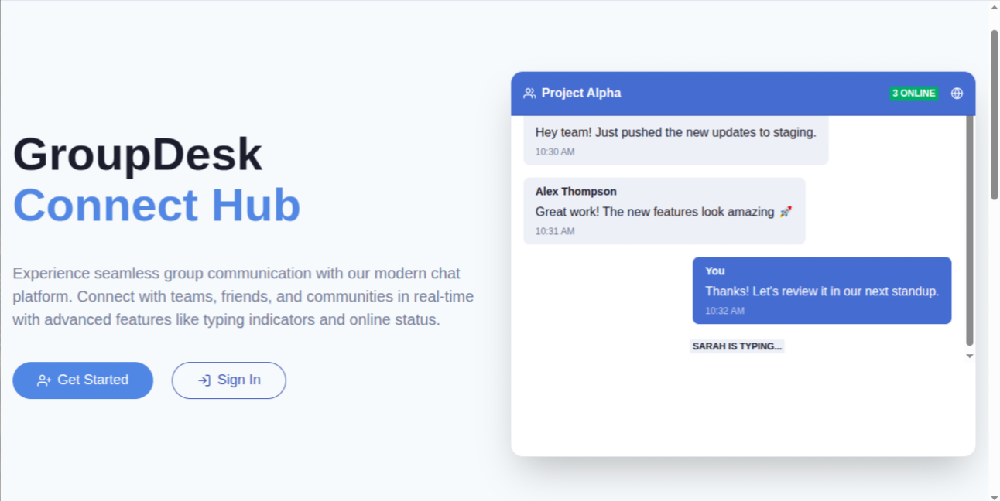
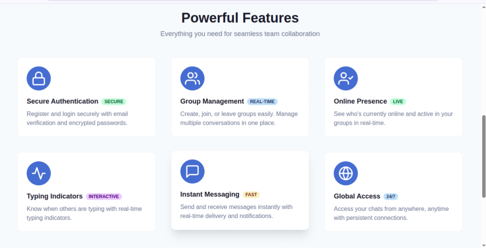
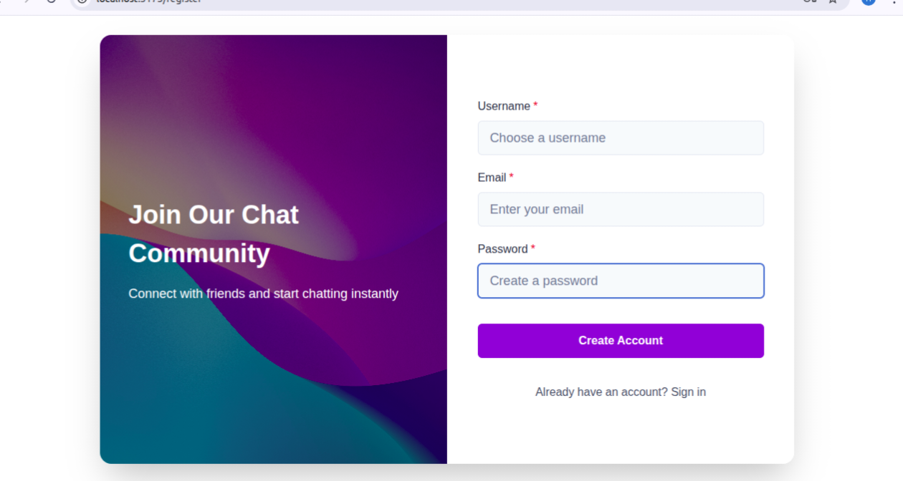
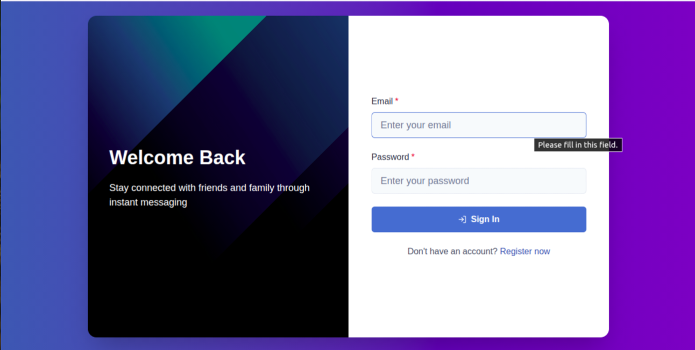
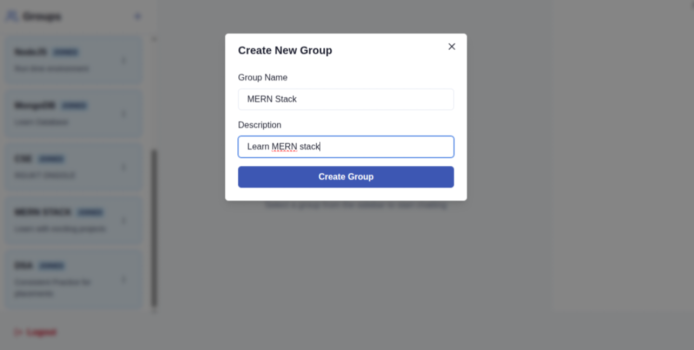
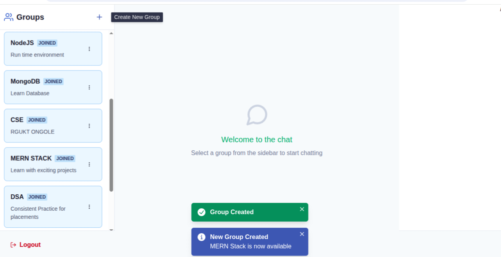
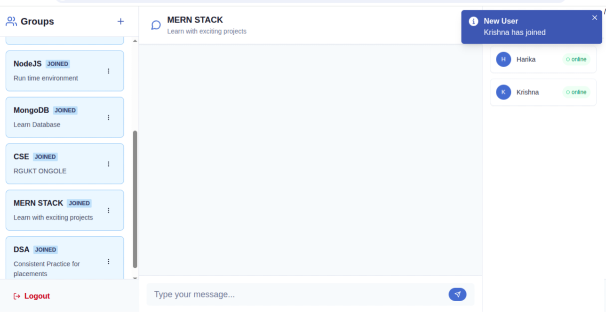
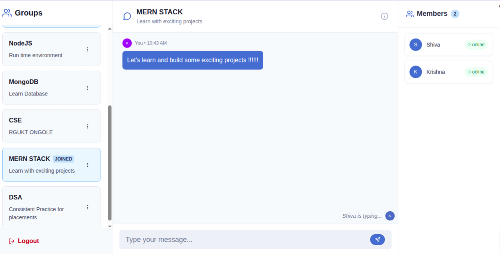
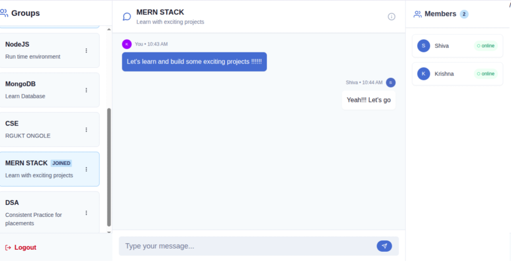

# Groupdesk Connect Hub 💬  

A real-time **group chat application** built with the **MERN stack** and **Socket.IO**, where admins can create/delete groups and users can join or leave groups. The app uses toast notifications to provide real-time feedback for user actions and admin events, making it highly interactive.  

## 🚀 Tech Stack  
- **Frontend**: React (Vite), Chakra UI, Axios, React Router, Toast Notifications  
- **Backend**: Node.js, Express.js, Socket.IO  
- **Database**: MongoDB (Mongoose ORM)  
- **Authentication**: JWT (JSON Web Tokens)  
- **Deployment**:  
  - Frontend → Netlify  
  - Backend → Render  

---

## ✨ Features  
- 🏠 **Landing Page (Groupdesk Connect Hub)**:  
  - Contains an overview of the app with 6 listed features  
  - Includes a demo-style chat preview to showcase how the app works  
- 🔐 **Authentication**: User registration, login & logout with JWT  
- 👥 **Group Chats Only**:  
  - Admins can create/delete groups  
  - Users can join/leave groups  
- 💬 **Real-time Messaging**: Messages inside groups are delivered instantly to all active members  
- 📢 **Toast Notifications**:  
  - Admin creates a group → All users notified  
  - Admin deletes a group → All users notified  
  - A user joins a group → Other members get a toast notification  
  - A user leaves a group → Other members get a toast notification  
  - Any group action (join, leave, delete) → Immediate toast notification to keep users engaged  
- ✍️ **Typing Indicators**: See when someone is typing in a group  
- 🟢 **Online/Offline Presence**: Track who’s currently active  
- 📱 **Responsive UI**: Works smoothly across devices  

---

## 📂 Project Structure  
MERN-CHAT/
│── frontend/ # React + Vite (UI)
│── backend/ # Node.js + Express + Socket.IO (API + Sockets)
│── README.md # Project documentation

yaml
Copy code

---

## ⚙️ Installation & Setup  

### 1️⃣ Clone the repository  
```bash
git clone https://github.com/your-username/MERN-CHAT.git
cd MERN-CHAT
2️⃣ Backend setup
bash
Copy code
cd backend
npm install
Create a .env file inside backend/ with:

env
Copy code
PORT=5000
MONGO_URI=your_mongodb_connection_string
JWT_SECRET=your_secret_key
Run backend:

bash
Copy code
npm start
3️⃣ Frontend setup
bash
Copy code
cd frontend
npm install
Create a .env file inside frontend/ with:

env
Copy code
VITE_API_URL=http://localhost:5000
Run frontend:

bash
Copy code
npm run dev
🚀 Deployment
Frontend (Netlify)
Push frontend/ to GitHub

Connect GitHub repo to Netlify

Add environment variable:

VITE_API_URL=https://your-backend.onrender.com

Backend (Render)
Push backend/ to GitHub

Create a new Render Web Service

Add environment variables:

MONGO_URI

JWT_SECRET

PORT=10000 (Render assigns one automatically)

📸 Screenshots
Add screenshots by placing them in a screenshots/ folder inside your repo. Example:

markdown
Copy code



















👨‍💻 Author
Developed by Mohan
